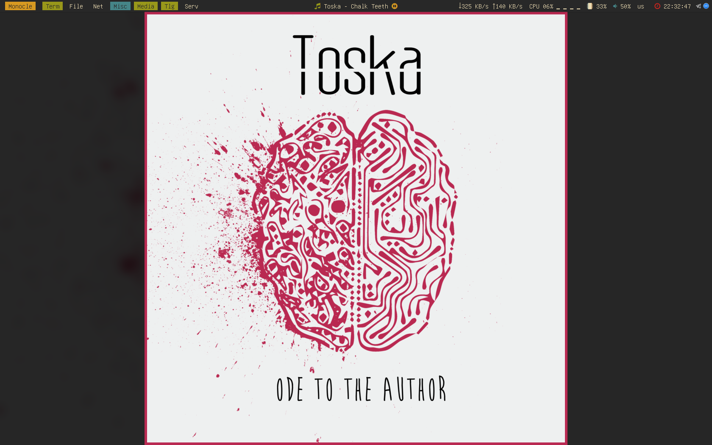

# mpd-wallpaper
Ever wanted to display currently playing song's artwork as a wallpaper? No?.. Well, you can now, so why not try it!

This script runs as a daemon which takes the currently playing track in MPD and uses some (image)magick to set it's artwork
as the wallpaper of your desktop.

It's kinda clever, though, so unlike kunst it gets your music path from the mpd config.

But it expects you to have a bar at the top, so it's kinda dumb, too.

# Introduction
One day I was thinking something like "Huh, it'd be cool to have some kind of album art in ncmpcpp... But setting up image display in alacritty is probably complicated... Hey, there is kunst, which also displays the artwork in a notification and activates on ncmpcpp's song change activity and there's an option to make the alacritty's background a bit transparent, so it'd be great to have a script to change the wallpaper to the playing track's artwork!"

And just like that I started writing this script. But then I also thought that it'd be better to make it independent of ncmpcpp
and make it launch at system startup, so here we are.

# Requirements
- bash
- dunst (optional, used for notifications)
- feh
- imagemagick
- kid3-cli
- mpc
- mpd (duh)
- xorg-xdpyinfo

# Usage
`mpd-wallpaper -f fallback.png [-b bottom_indent] [-B border] [-n] [-t top_indent]`

For example, 

`mpd-wallpaper -f ~/Pictures/Wallpapers/GiTS/1.png -n -t 28 -B 6`

# Exapmles

desktop

ncmpcpp

